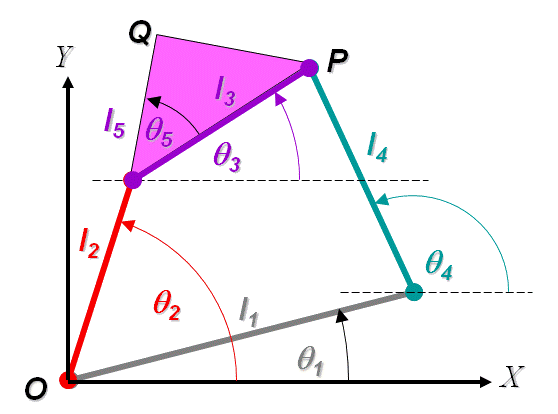

## Introduction
The 4 bar RRRR mechanism is forms the basis of any study on mechanism. It is widely used in various forms because of the relative simplicity of design and manufacture as well as durability. Grashof's criteria is used to distinguish between 4 bar RRRR linkages depending on the rotatability of the individual links of a 4 bar mechanism. In brief, if l is the longest link, s the longest link and the other two links have length p and q then the following cases arise

 

 
Schematic Diagram of a 4 Bar RRRR Linkage

- l + s < p + q   :  Grashofian Linkage
   - l + s < p + q , shortest link s is the ground link  :   Double Crank
   - l + s < p + q , shortest link is the coupler :  Double Rocker
   - l + s < p + q , shortest link is neither coupler nor ground  :   Crank Rocker
- l + s > p + q   :   Non Grashofian Double Rocker

For a more detailed introduction to Grashof criteria see the animated guide that follows. You can either click on the animation itself to move from step to step as per your convenience. Alternatively you can use the controls at the bottom of the animation to see it at your own pace.

### Grashof's criterion

                                <object width="900" height="700" data="./content/Grashof_RRRR/index.html"></object>
                            

In a Double Crank both the input link (link 2) and the output link (link 4) can rotate through a full circle. The position analysis of a Double Crank involves finding out the coupler curve (that is the curve traced by a point on the link 4, which is the coupler, or its extensions) and the relation between the input and output orientations, that is the relation between theta 2 and theta 4. Since the input link rotates through a full circle it is possible to drive this mechanism using a simple continuous rotary drive, that is we may connect it directly to a simple motor. Likewise we can connect the output to a continuous rotary drive directly too. Thus we can use this mechanism to cyclically generate a varying pattern of rotation by suitably choosing the link lengths and simply connecting the input link to a constant RPM motor. Alternately a constant torque motor at the input can produce a varying torque at the output, which also implies a varying mechanical advantage.

## Demo

                                <object width="900" height="700" data="./content/demo/demo/demo_RRRR.html"></object>
                            
 

Animation of a 4 Bar Double Crank
- Clicking on the buttons will rotate the crank in the directions indicated. The slider can be used for controlled rotation.
- The view can be rotated about a point by keeping the left mouse button pressed and rotating the mouse.
- The view can be translated by keeping the right mouse button pressed and translating the mouse in the desired direction
- The scroll button or middle mouse button can be used for zooming.
- The view can be rotated about the coordinate axes by using the left (<--) and right (-->) keys and the Page Up and Page Down keys on the keyboard.
- Using the Up Arrow and Down Arrow keys will move the view towards or away from the viewer..
- The - and + (or Shift + =) keys may be used for zooming out and zooming in.
- Pressing the = key will get the view back to default.